# SplitEasier

SplitEasier is a full-stack, itemized bill-splitting app for roommates, trips, and shared households.  
It combines precise per-item splitting, collaborative group management, AI receipt parsing, and optional Splitwise sync.

## Table of Contents
- Product Overview
- Feature Highlights
- Architecture
- Screenshots
- PWA Support
- AWS Architecture (Bedrock + OCR)
- Data Model
- API Summary
- Tech Stack
- Project Structure
- Local Setup
- Environment Variables
- Deployment
- Security Notes
- License

## Product Overview
Traditional expense apps usually split totals evenly. SplitEasier is designed for real-world receipts where each person consumes different items.

Core idea:
- bills are broken into line items
- each line item is assigned to one or more members
- totals are calculated from actual participation, not rough averages

The app supports:
- email/password authentication
- Splitwise OAuth sign-in
- household creation and member management
- create/edit/delete bills with item-level splits
- AI receipt-to-items import
- Splitwise push and pull synchronization with conflict detection

## Feature Highlights
- Itemized bill logic: exact per-person shares based on item assignment.
- Receipt AI import: upload an image and prefill bill name/items.
- Household management: owner/member permissions and invite-by-email.
- Splitwise integration:
  - push local bill changes to Splitwise expenses
  - pull Splitwise expenses back into local bills
  - conflict marking when both local and remote changed
- Responsive UX + PWA install support, including iOS standalone behavior.

## Architecture
### High-level system
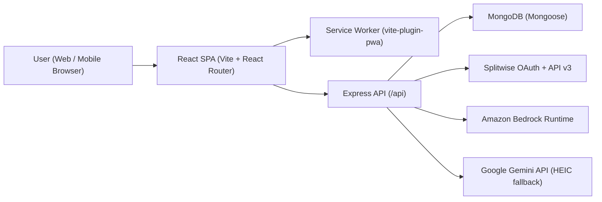

### Splitwise sync lifecycle
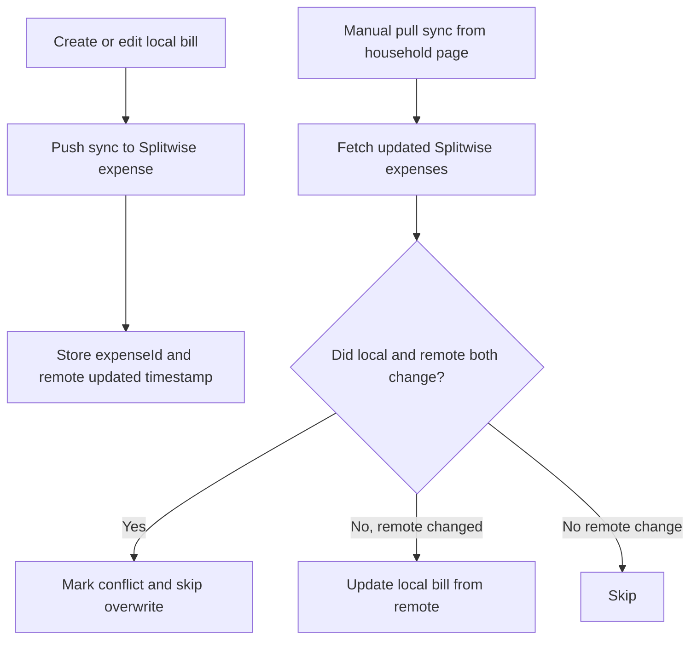

### Runtime components
- Frontend: `src/main.jsx`, `src/App.jsx`, `src/pages/*`
- API server: `server/app.js`, `server/routes/*`, `server/lib/*`
- Serverless bridge (Vercel): `api/index.js`
- Database models: `server/models/User.js`, `server/models/Household.js`, `server/models/Bill.js`

## Screenshots
All screenshots are sourced from `/screenshots`.

### 1. Landing + authentication
<p align="center">
  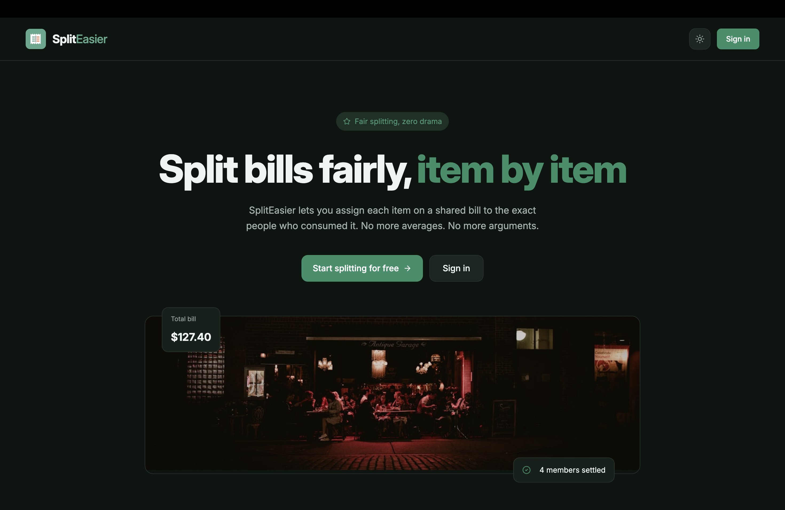
  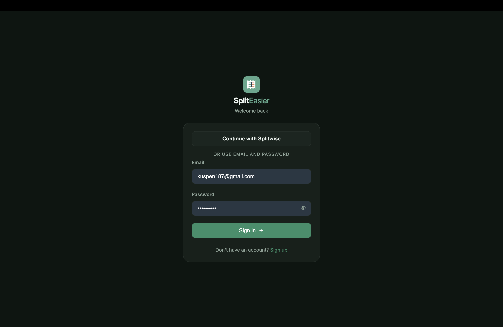
</p>
<p align="center"><em>Public marketing page and sign-in flow.</em></p>

### 2. Household and bill workspace
<p align="center">
  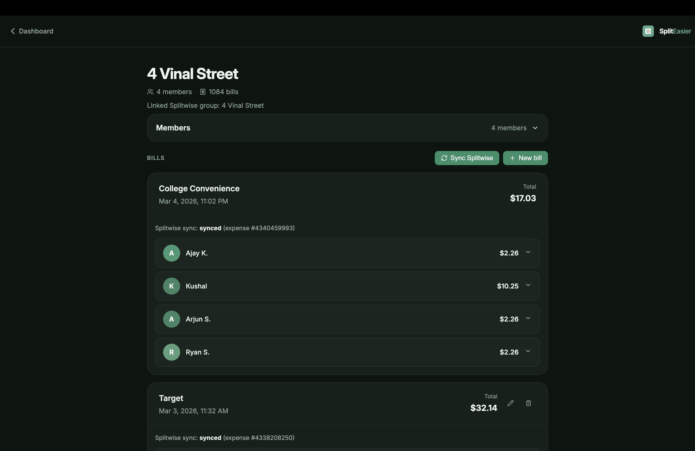
  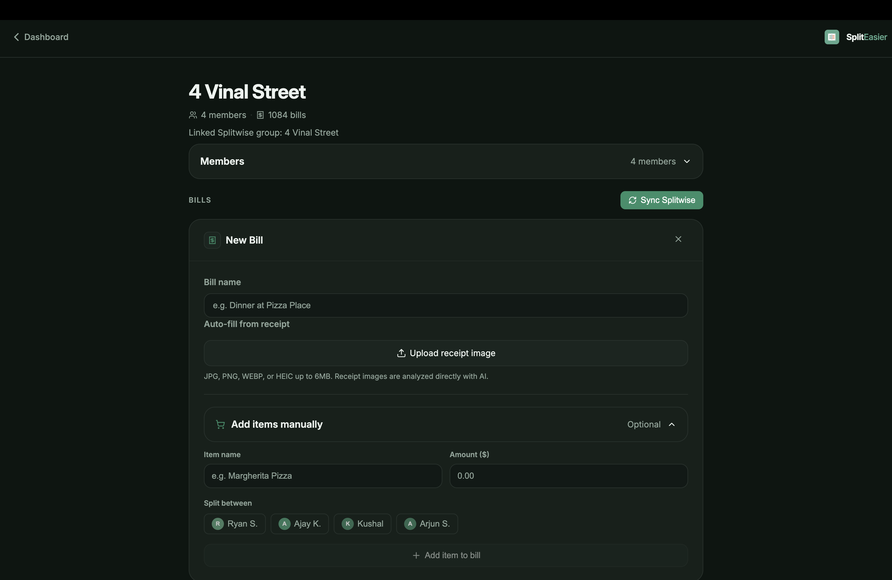
</p>
<p align="center"><em>Household-level collaboration and saved bill breakdowns.</em></p>

### 3. Item assignment and AI import
<p align="center">
  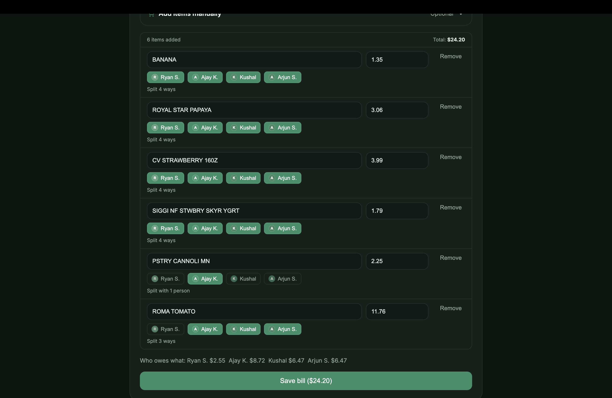
  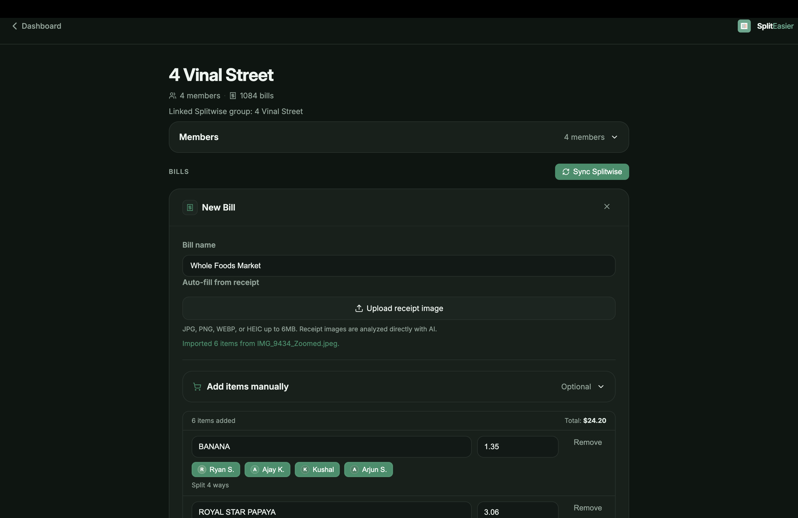
</p>
<p align="center"><em>Per-item participant selection and AI-assisted receipt extraction.</em></p>

### 4. iOS PWA screenshots
<p align="center">
  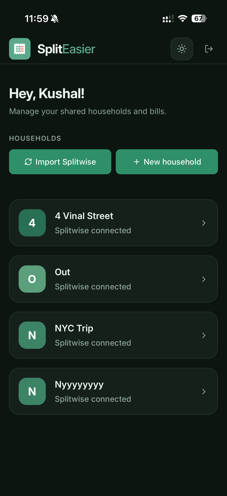
  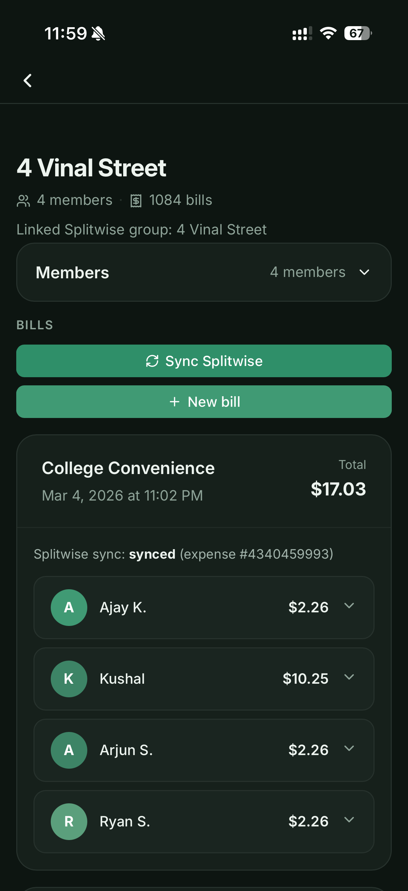
  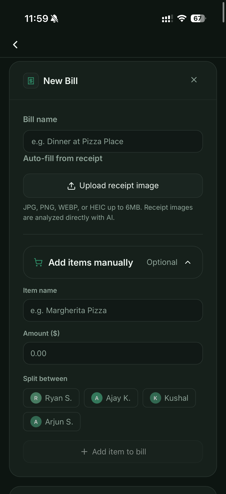
</p>

## PWA Support
SplitEasier is configured as a Progressive Web App via `vite-plugin-pwa`.

Implemented behavior:
- service worker registration: `registerSW({ immediate: true })`
- `autoUpdate` registration strategy
- standalone manifest configuration:
  - `display: standalone`
  - `start_url: /`
  - icon set (`icon-192`, `icon-512`, `icon.svg`)
- API safety rule: Workbox navigation fallback explicitly excludes `/api/*`
- iOS-specific runtime classes:
  - `is-ios`
  - `is-standalone`
- iOS standalone route handling:
  - when launched as standalone and unauthenticated, `/` redirects to `/login`

### PWA architecture
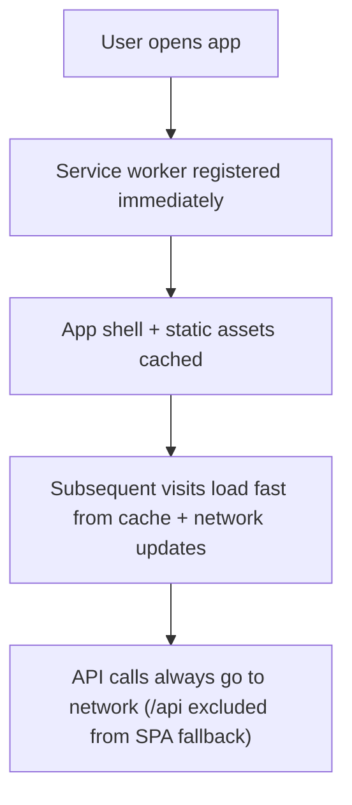

## AWS Architecture (Bedrock + OCR)
SplitEasier's current AWS integration is focused on AI receipt extraction through Amazon Bedrock Runtime.

### Current AWS touchpoints
- Amazon Bedrock Runtime endpoint (`bedrock-runtime.<region>.amazonaws.com`)
- Model configured via `BEDROCK_MODEL`
- Region configured via `BEDROCK_REGION`
- Auth via `AWS_BEARER_TOKEN_BEDROCK` (or `BEDROCK_API_KEY`)

### OCR provider routing
- non-HEIC images (`jpg/png/webp/gif`) -> Bedrock (default)
- HEIC/HEIF -> Gemini fallback (`OCR_HEIC_PROVIDER=gemini` by default)

### Receipt ingestion flow
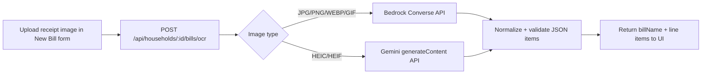

## Data Model
### `User`
- identity: `email`, `name`, `passwordHash`
- external link: `splitwise.id`
- tokens: `splitwise.accessToken`, `refreshToken`, `expiresAt`

### `Household`
- ownership/membership: `ownerId`, `memberIds`
- Splitwise link: `splitwiseGroupId`, `splitwiseGroupName`
- sync cursor: `splitwiseLastCursor`, `splitwiseLastPulledAt`

### `Bill`
- composition: `billName`, `items[]`, `totalAmount`, `totals`
- ownership: `createdBy`, `householdId`
- sync metadata (`splitwiseSync`):
  - `status` (`pending | synced | failed | skipped`)
  - `expenseId`, `expenseUpdatedAt`
  - `lastLocalEditAt`, `lastSyncDirection`
  - `conflict`

## API Summary
Base path: `/api`

### Auth
- `POST /auth/register`
- `POST /auth/login`
- `GET /auth/splitwise/start`
- `GET /auth/splitwise/callback`

### Users
- `GET /users/me`
- `GET /users/search?q=...`

### Households
- `GET /households`
- `POST /households`
- `GET /households/:id`
- `PATCH /households/:id`
- `POST /households/:id/members`
- `DELETE /households/:id/members/:userId`
- `POST /households/import-splitwise`
- `POST /households/:id/sync-splitwise`

### Bills
- `GET /households/:householdId/bills`
- `POST /households/:householdId/bills`
- `GET /households/:householdId/bills/:billId`
- `PATCH /households/:householdId/bills/:billId`
- `DELETE /households/:householdId/bills/:billId`
- `POST /households/:householdId/bills/ocr`

### Splitwise passthrough
- `GET /splitwise/connection`
- `GET /splitwise/current-user`
- `GET /splitwise/groups`
- `GET /splitwise/expenses`
- `POST /splitwise/expenses`

## Tech Stack
Frontend:
- React 18
- React Router
- Motion (`motion/react`)
- Vite
- `vite-plugin-pwa`

Backend:
- Node.js + Express
- MongoDB + Mongoose
- JWT (`jsonwebtoken`)
- Splitwise OAuth + REST integration

AI/OCR:
- Amazon Bedrock Runtime (primary)
- Google Gemini (HEIC fallback route by default)

Deployment:
- Vercel static frontend build (`dist/`)
- Vercel serverless API entry (`api/index.js`)

## Project Structure
```text
.
├── api/                  # Vercel serverless bridge
├── public/               # PWA icons/assets
├── screenshots/          # README screenshots
├── server/
│   ├── lib/              # OCR + Splitwise helpers
│   ├── middleware/       # JWT auth middleware
│   ├── models/           # Mongoose models
│   └── routes/           # API routes
├── src/
│   ├── api/              # frontend API client
│   ├── components/       # UI components
│   ├── context/          # auth/theme state
│   └── pages/            # routed pages
├── vite.config.js
└── vercel.json
```

## Local Setup
### Prerequisites
- Node.js 18+
- npm
- MongoDB URI
- Splitwise dev app (for OAuth flows)

### 1) Install dependencies
```bash
npm install
```

### 2) Configure environment
```bash
cp .env.example .env
```

Set required values in `.env`.

### 3) Run backend
```bash
npm run server
```

### 4) Run frontend
```bash
npm run dev
```

Frontend runs on `http://localhost:5173` and proxies `/api` to `http://localhost:3001`.

## Environment Variables
### Required
| Variable | Purpose |
|---|---|
| `MONGO_URI` | MongoDB connection string |
| `JWT_SECRET` | JWT signing secret |
| `FRONTEND_URL` | Frontend origin for callback behavior |
| `SPLITWISE_CLIENT_ID` | Splitwise OAuth app client ID |
| `SPLITWISE_CLIENT_SECRET` | Splitwise OAuth app secret |
| `SPLITWISE_REDIRECT_URI` | Splitwise OAuth callback URI |

### AI / OCR
| Variable | Default | Purpose |
|---|---|---|
| `BEDROCK_REGION` | `us-east-1` | Bedrock runtime region |
| `BEDROCK_MODEL` | `anthropic.claude-3-haiku-20240307-v1:0` | Bedrock model ID |
| `AWS_BEARER_TOKEN_BEDROCK` | - | Bedrock bearer auth token |
| `OCR_IMAGE_PROVIDER` | `bedrock` | Provider for standard image OCR extraction |
| `OCR_HEIC_PROVIDER` | `gemini` | Provider for HEIC/HEIF extraction |
| `GEMINI_API_KEY` | - | Needed when Gemini route is active |
| `GEMINI_MODEL` | `gemini-2.5-flash` | Gemini model |

### Optional
| Variable | Default |
|---|---|
| `JWT_EXPIRES_IN` | `7d` |
| `OCR_TEXT_CHAR_LIMIT` | `12000` |
| `OCR_MAX_RAW_TEXT_CHARS` | `50000` |
| `SPLITWISE_BASE_URL` | `https://secure.splitwise.com` |
| `SPLITWISE_API_BASE` | `https://secure.splitwise.com/api/v3.0` |
| `SPLITWISE_STATE_SECRET` | falls back to `JWT_SECRET` |
| `PORT` / `SERVER_PORT` | `3001` |

## Deployment
Current deployment model:
- frontend: Vite build output in `dist/`
- backend: serverless function through `api/index.js` (exports Express app)
- rewrites configured in `vercel.json`:
  - `/api/:path* -> /api`
  - non-API routes -> `/index.html`

Build command:
```bash
npm run build
```

## Security Notes
- JWT-based API authentication for protected routes.
- Splitwise tokens are stored server-side under `User.splitwise`.
- Input and permission checks are enforced in household/bill routes.
- Conflict-safe pull sync avoids silent data overwrite when local and remote changed.

## License
MIT License. See `LICENSE`.
